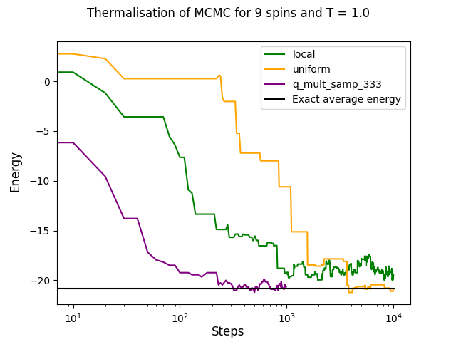

# Coarse grained Quantum-enhanced Markov Chain Monte Carlo

This is the code that was used for the numerical results in the paper: [Quantum-enhanced Markov Chain Monte Carlo for systems larger than your Quantum Computer](https://arxiv.org/abs/2405.04247)

It builds upon the numerics in Layden's work on the [Quantum enhanced Markov Chain Monte Carlo (QeMCMC)](https://www.nature.com/articles/s41586-023-06095-4), with the main contribution focussed on applying a "coarse graining" to the quantum proposal in order to analyse the possibility of some dampened quantum speedup remaining while the number of required qubits is lowered. 

Please see also https://github.com/pafloxy/quMCMC, which was used as a starting point for this code.

## Authors and contact
For questions and suggestions, please contact Stuart Ferguson: S.A.Ferguson-3@sms.ed.ac.uk

This project was created by:
* Stuart Ferguson

## License

Distributed under the MIT License. See LICENSE.txt for more information.

## Acknowledgements

* https://github.com/pafloxy/quMCMC, an open-source code which was used as a starting point for this code.
* [QeMCMC by David Layden et al.](https://www.nature.com/articles/s41586-023-06095-4)
* [Quantum-enhanced Markov Chain Monte Carlo for systems larger than your Quantum Computer by S. Ferguson and P. Wallden](https://arxiv.org/abs/2405.04247)
* [Qulacs Simulator](https://quantum-journal.org/papers/q-2021-10-06-559/)
Quantum-enhanced Markov chain Monte Carlo by David Layden et al. https://www.nature.com/articles/s41586-023-06095-4

## Tutorial

An example experiment is given in the folder titled "Experiment", where a Markov Chain Monte Carlo algorithm is run for an example 9 spin instance. Classical "Uniform" and "local" update proposals are compared with a CGQeMCMC implimentation using only 3 simulated qubits. Even though the number of qubits is quadratically reduced from the number requred by the original algorithm of Layden et al, we still see quantum speedup. The following results can be viewed by running Analyse_all.py.

We also include a tutorial jupyter notebook "tutorial.ipynb"

